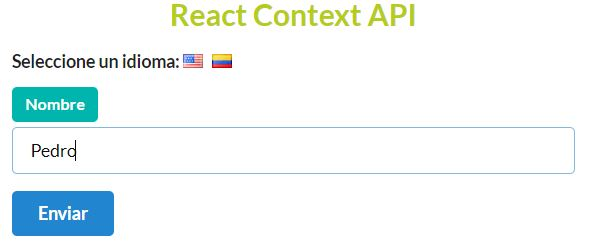

## Context API Language Selector Form

The objective of this project is to learn the fundamentals of the React Context API.   
It consists of a language selector which the user can click to switch between English and Spanish to display the user input form and submit button text in their respective languages.  
The App uses a LanguageStore class component to wrap and send via this.props.children the current selected language down to the nested children components through the Context.Provider.

## Built With

- ReactJS
- React Context API
- HTML5

## App Screenshot





## Setup instructions

Open a terminal window, go to the location you'd like to add the project and then run the commands below.

```console
git clone https://github.com/noomdalv/react_context_form.git
```

```console
cd react_context_form
```

```console
npm install
```

```console
npm start

```

#### Special Thanks to [Stephen Grider](https://www.udemy.com/user/sgslo/) for his amazing tutorial.

## Author

👤 **Vladimir Luna**

- Github: [@noomdalv](https://github.com/noomdalv)


## 📝 License

This project is [MIT](lic.url) licensed.
